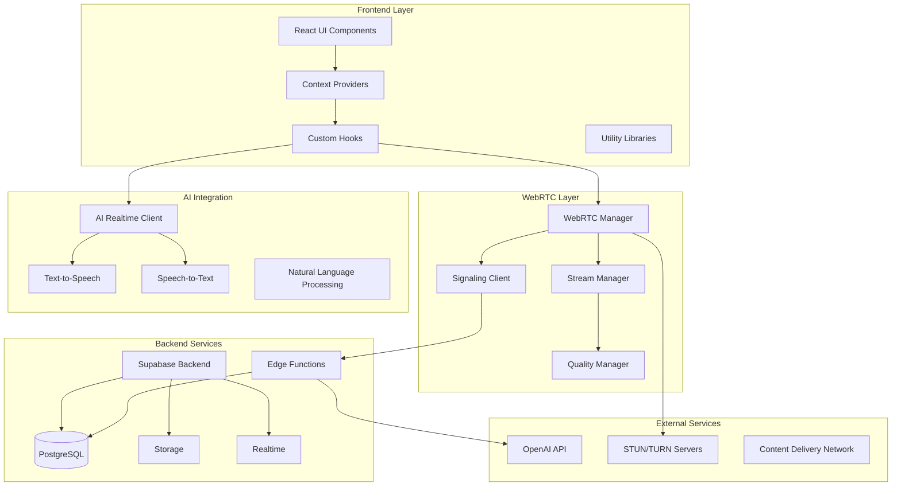
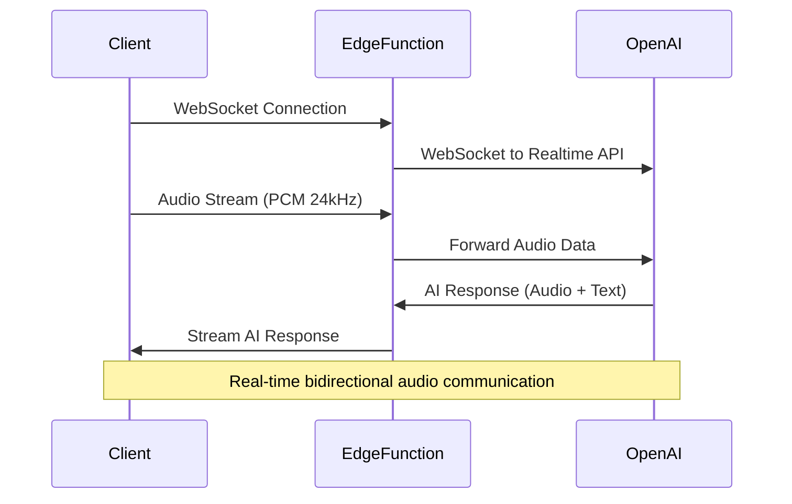
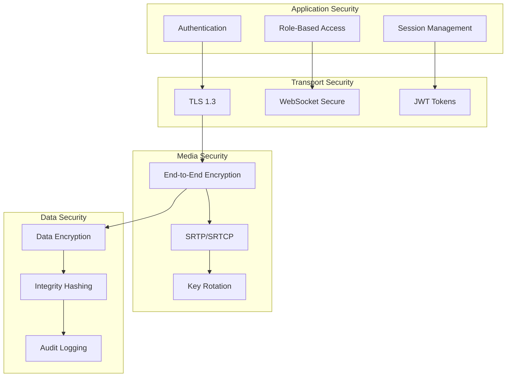
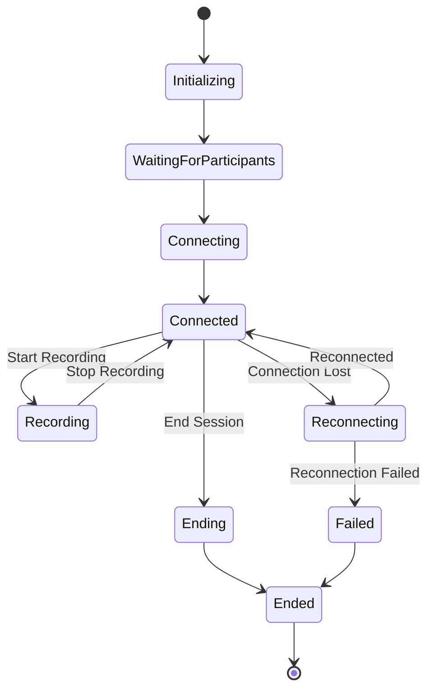
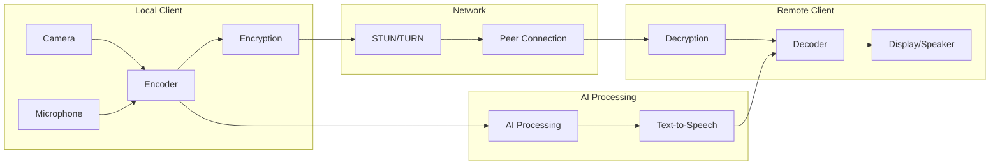
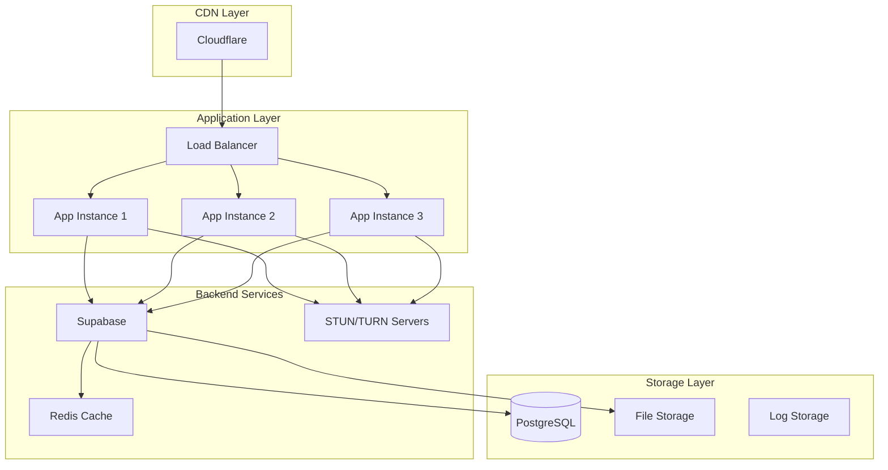

# WebRTC Video Conference Platform - System Architecture

## Overview

This document provides a comprehensive overview of the WebRTC-based video conference platform architecture, designed for secure, scalable, and high-quality real-time communication with AI integration.

## Table of Contents

1. [System Architecture](#system-architecture)
2. [Core Components](#core-components)
3. [WebRTC Implementation](#webrtc-implementation)
4. [AI Integration](#ai-integration)
5. [Security Architecture](#security-architecture)
6. [Data Flow](#data-flow)
7. [Deployment Architecture](#deployment-architecture)
8. [Performance Considerations](#performance-considerations)
9. [Future Roadmap](#future-roadmap)

## System Architecture



## Core Components

### 1. Frontend Architecture

#### React Component Hierarchy
```
App
├── AuthRBACProvider
├── VideoSessionProvider/WebRTCSessionProvider
│   ├── VideoConference
│   │   ├── VideoConferenceContent
│   │   ├── SessionControls
│   │   ├── ParticipantGrid
│   │   └── ChatInterface
│   ├── AISessionInterface
│   │   ├── VoiceControls
│   │   ├── TranscriptionDisplay
│   │   └── AIResponseIndicator
│   └── SessionAnalyticsDashboard
│       ├── RealTimeMetrics
│       ├── ParticipantAnalytics
│       └── QualityMonitoring
└── NavigationComponents
```

#### Context Providers
- **AuthRBACContext**: Authentication and role-based access control
- **WebRTCSessionContext**: Unified WebRTC session management
- **VideoSessionContext**: Legacy compatibility layer
- **ThemeProvider**: Design system and theming

#### Custom Hooks
- **useWebRTCConnection**: Core WebRTC functionality
- **useMediaDevices**: Device management and permissions
- **useSessionAnalytics**: Real-time session monitoring
- **useOpenAIRealtime**: AI voice integration
- **useSecureFileSharing**: File transfer capabilities

### 2. WebRTC Implementation

#### Core WebRTC Stack
```typescript
interface WebRTCStack {
  manager: WebRTCManager;           // Central coordination
  signaling: SignalingClient;       // Signaling protocol
  peerConnection: RTCPeerConnection; // WebRTC connection
  streamManager: StreamManager;     // Media stream handling
  qualityManager: QualityManager;   // Adaptive quality
  securityLayer: EnhancedSecurity;  // E2E encryption
}
```

#### Signaling Protocol
- **Transport**: WebSocket over HTTPS
- **Message Types**: 
  - `offer`, `answer`, `ice-candidate`
  - `participant-joined`, `participant-left`
  - `media-state-changed`, `quality-update`
- **Authentication**: JWT-based with Supabase
- **Encryption**: TLS 1.3 for transport, E2E for media

#### Media Handling
```typescript
interface MediaConfiguration {
  video: {
    resolution: '720p' | '1080p' | '4K';
    frameRate: 15 | 30 | 60;
    codec: 'VP8' | 'VP9' | 'H.264';
    bitrate: number;
  };
  audio: {
    codec: 'Opus' | 'G.722';
    sampleRate: 16000 | 24000 | 48000;
    channels: 1 | 2;
    bitrate: number;
  };
}
```

### 3. AI Integration Architecture

#### OpenAI Realtime API Integration


#### AI Features
- **Voice-to-Voice**: Direct audio communication with AI
- **Transcription**: Real-time speech-to-text conversion
- **Translation**: Multi-language support
- **Sentiment Analysis**: Emotional state detection
- **Meeting Insights**: Automated summaries and action items

### 4. Security Architecture

#### Multi-Layer Security Model


#### Security Features
- **End-to-End Encryption**: AES-256-GCM for media streams
- **Perfect Forward Secrecy**: Automatic key rotation
- **Threat Detection**: Real-time security monitoring
- **HIPAA Compliance**: Healthcare data protection
- **Audit Trail**: Comprehensive security logging

### 5. Database Schema

#### Core Tables
```sql
-- User management
CREATE TABLE profiles (
  id UUID PRIMARY KEY,
  user_id UUID REFERENCES auth.users,
  role TEXT CHECK (role IN ('patient', 'therapist', 'admin')),
  created_at TIMESTAMPTZ DEFAULT now()
);

-- Session management
CREATE TABLE video_sessions (
  id UUID PRIMARY KEY,
  session_type TEXT CHECK (session_type IN ('appointment', 'instant')),
  status TEXT CHECK (status IN ('scheduled', 'active', 'ended')),
  created_by UUID REFERENCES auth.users,
  created_at TIMESTAMPTZ DEFAULT now()
);

-- Session participants
CREATE TABLE session_participants (
  id UUID PRIMARY KEY,
  session_id UUID REFERENCES video_sessions,
  user_id UUID REFERENCES auth.users,
  role TEXT CHECK (role IN ('host', 'participant')),
  joined_at TIMESTAMPTZ,
  left_at TIMESTAMPTZ
);

-- Session analytics
CREATE TABLE session_analytics (
  id UUID PRIMARY KEY,
  session_id UUID REFERENCES video_sessions,
  metrics JSONB,
  recorded_at TIMESTAMPTZ DEFAULT now()
);

-- File sharing
CREATE TABLE shared_files (
  id UUID PRIMARY KEY,
  session_id UUID REFERENCES video_sessions,
  uploaded_by UUID REFERENCES auth.users,
  file_name TEXT,
  file_size BIGINT,
  file_type TEXT,
  storage_path TEXT,
  encrypted BOOLEAN DEFAULT true,
  created_at TIMESTAMPTZ DEFAULT now()
);
```

### 6. Data Flow Architecture

#### Session Lifecycle


#### Media Data Flow


### 7. Performance Architecture

#### Optimization Strategies
- **Adaptive Bitrate**: Dynamic quality adjustment based on network conditions
- **Simulcast**: Multiple quality streams for efficient bandwidth usage
- **Hardware Acceleration**: GPU-accelerated encoding/decoding when available
- **Edge Computing**: CDN-based STUN/TURN servers for low latency
- **Connection Pooling**: Efficient WebSocket connection management

#### Quality Management
```typescript
interface QualityMetrics {
  bitrate: number;          // Current bitrate (bps)
  frameRate: number;        // Frames per second
  resolution: string;       // Video resolution
  packetLoss: number;       // Packet loss percentage
  latency: number;          // Round-trip time (ms)
  jitter: number;           // Jitter (ms)
  quality: 'excellent' | 'good' | 'fair' | 'poor';
}
```

### 8. Scalability Architecture

#### Horizontal Scaling
- **Load Balancing**: Multiple WebRTC gateway instances
- **Geographic Distribution**: Edge servers for global reach
- **Database Sharding**: Partitioned data for high volume
- **Microservices**: Independently scalable components

#### Resource Management
- **Connection Limits**: Per-server participant limits
- **Bandwidth Throttling**: Fair usage policies
- **Storage Tiering**: Hot/cold data optimization
- **Caching Strategy**: Redis for session state

### 9. Monitoring and Observability

#### Metrics Collection
```typescript
interface SystemMetrics {
  sessions: {
    active: number;
    total: number;
    avgDuration: number;
    qualityDistribution: Record<string, number>;
  };
  performance: {
    cpuUsage: number;
    memoryUsage: number;
    networkBandwidth: number;
    diskUsage: number;
  };
  errors: {
    connectionFailures: number;
    audioIssues: number;
    videoIssues: number;
    systemErrors: number;
  };
}
```

#### Logging Strategy
- **Structured Logging**: JSON format with correlation IDs
- **Log Levels**: ERROR, WARN, INFO, DEBUG
- **Security Events**: Separate audit trail
- **Performance Logs**: Metrics and traces

### 10. Deployment Architecture

#### Production Environment


#### Environment Configuration
- **Development**: Local Supabase, local STUN server
- **Staging**: Supabase staging, cloud STUN servers
- **Production**: Supabase production, global STUN network

### 11. Error Handling and Recovery

#### Error Classification
```typescript
enum ErrorType {
  NETWORK_ERROR = 'network_error',
  PERMISSION_ERROR = 'permission_error',
  DEVICE_ERROR = 'device_error',
  SIGNALING_ERROR = 'signaling_error',
  SECURITY_ERROR = 'security_error',
  AI_ERROR = 'ai_error'
}
```

#### Recovery Strategies
- **Automatic Reconnection**: Exponential backoff with jitter
- **Graceful Degradation**: Fallback to audio-only mode
- **Device Switching**: Automatic device fallback
- **Network Adaptation**: Quality adjustment on poor connections

### 12. API Documentation

#### WebRTC Session API
```typescript
interface WebRTCSessionAPI {
  // Session management
  createSession(config: SessionConfig): Promise<Session>;
  joinSession(sessionId: string): Promise<void>;
  leaveSession(): Promise<void>;
  
  // Media controls
  toggleVideo(): Promise<boolean>;
  toggleAudio(): Promise<boolean>;
  shareScreen(): Promise<boolean>;
  
  // Device management
  getDevices(): Promise<MediaDeviceInfo[]>;
  switchDevice(type: DeviceType, deviceId: string): Promise<void>;
  
  // Analytics
  getMetrics(): Promise<SessionMetrics>;
  exportAnalytics(): Promise<AnalyticsReport>;
}
```

#### AI Integration API
```typescript
interface AIIntegrationAPI {
  // Voice communication
  startVoiceSession(): Promise<void>;
  sendVoiceMessage(audio: ArrayBuffer): Promise<void>;
  
  // Text processing
  transcribeAudio(audio: ArrayBuffer): Promise<string>;
  generateResponse(text: string): Promise<string>;
  
  // Analysis
  analyzeSentiment(text: string): Promise<SentimentResult>;
  generateSummary(transcript: string): Promise<Summary>;
}
```

### 13. Testing Strategy

#### Test Coverage
- **Unit Tests**: Individual component testing
- **Integration Tests**: Component interaction testing
- **E2E Tests**: Full user workflow testing
- **Performance Tests**: Load and stress testing
- **Security Tests**: Vulnerability scanning

#### Test Automation
```yaml
# CI/CD Pipeline
stages:
  - test:unit
  - test:integration
  - test:e2e
  - security:scan
  - performance:test
  - deploy:staging
  - test:acceptance
  - deploy:production
```

### 14. Future Roadmap

#### Phase 4: Advanced Features (Next Quarter)
- **Multi-party Sessions**: Support for group calls (3+ participants)
- **Advanced Analytics**: ML-powered insights and recommendations
- **Mobile Applications**: Native iOS/Android apps
- **API Gateway**: Public API for third-party integrations

#### Phase 5: Enterprise Features
- **White-label Solution**: Customizable branding and deployment
- **Advanced Security**: Zero-trust architecture
- **Compliance Certifications**: SOC 2, ISO 27001
- **On-premise Deployment**: Self-hosted options

#### Technology Evolution
- **WebRTC Advancements**: AV1 codec, WebCodecs API
- **AI Improvements**: GPT-5 integration, custom models
- **Network Optimization**: QUIC protocol, WebTransport
- **Edge Computing**: Distributed processing nodes

## Conclusion

This architecture provides a robust, scalable, and secure foundation for real-time video communication with AI integration. The modular design allows for incremental improvements while maintaining system stability and performance.

The combination of modern WebRTC technologies, AI-powered features, and comprehensive security measures creates a platform capable of supporting diverse use cases from healthcare consultations to business meetings.

For technical implementation details, refer to the individual component documentation and API specifications in the `/docs` directory.