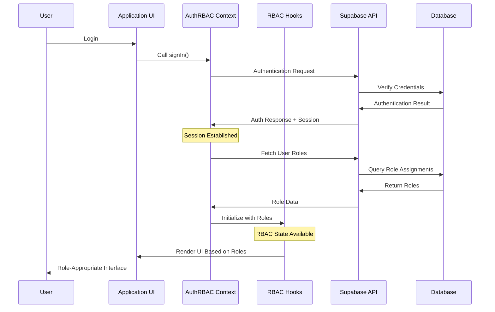
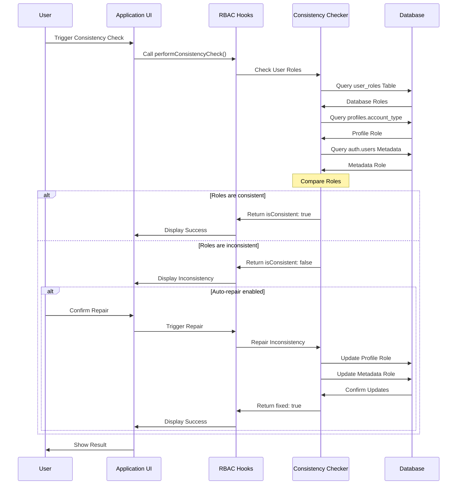
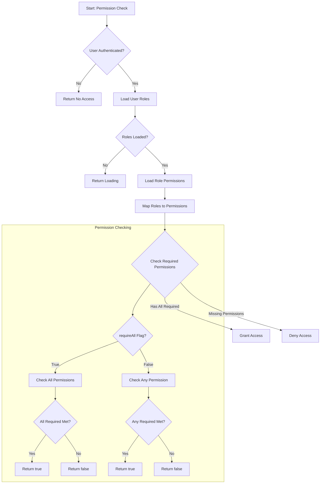
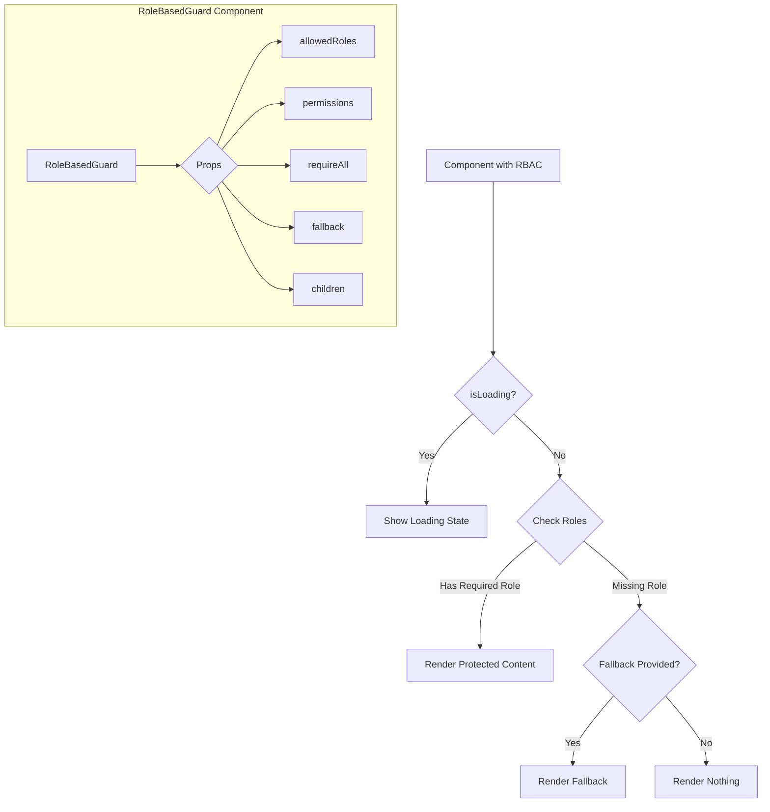
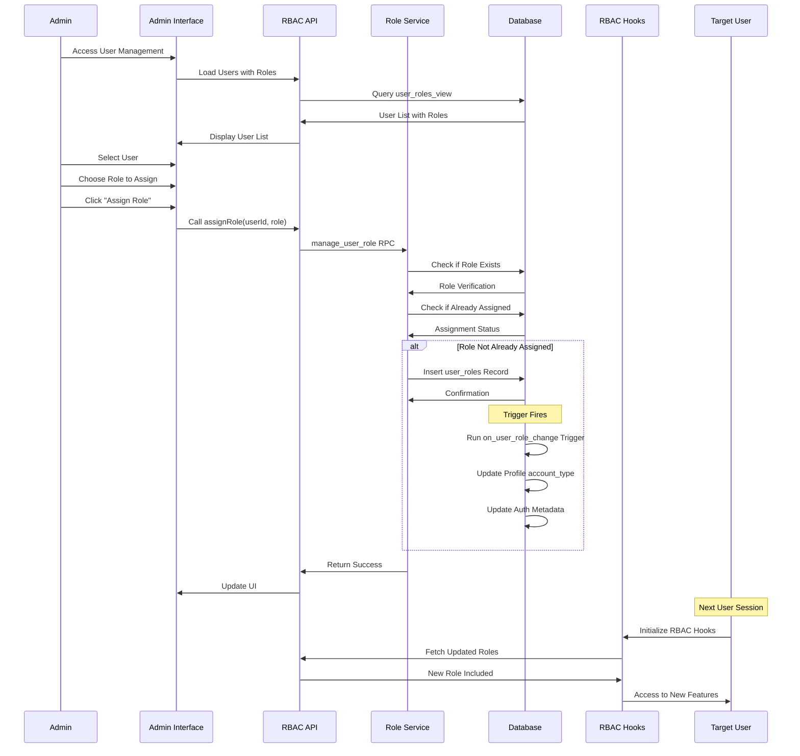
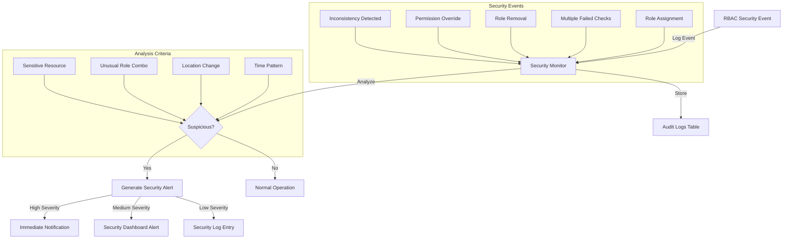

# RBAC System Flow Diagrams

This document contains flow diagrams illustrating key processes in the RBAC system.

## Authentication and Role Resolution Flow

## Role Consistency Check and Repair

## Permission Resolution Flow

## Role-Based Component Rendering

## Role Assignment Process

## Security Monitoring Flow

